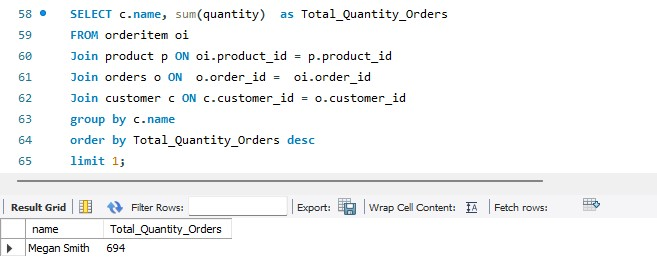
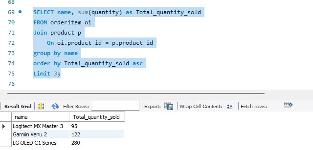
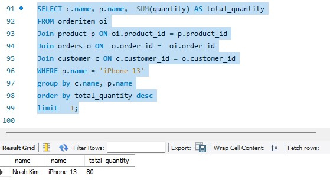
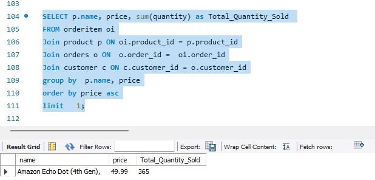
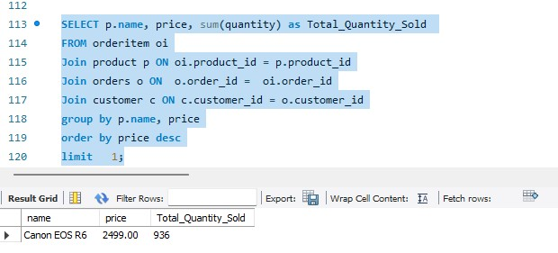

# SQL-GadgetSales-Project-

## Data Source
GadgetSales datasets was used for this project

## Intoduction
Mr. Chinedu has a shop where he sells different kinds of gadgets. He heard you are the data analyst, has been looking for one to help him answer some crucial questions about his business. You have been granted access to a database file called “GadgetSales.sql” containing consumer, orders, order item and product tables.(Which should you already have imported)

## Problem Statement / Questions
1. Which device had the most sales by quantity?
2. Which device had the lowest sales by quantity?
3. Top 3 most expensive gadgets.
4. Top 3 customer names that spent the most. (Hint: Sum of product of price and quantity)
5. Which order date did the least quantity of gadget sold?
6. Which customer name had the most orders by quantity?
7. List 3 devices with the lowest sales by quantity.
8. On which order date did “iPad Pro” had the most sales by quantity?
9. Which customer name bought “iPhone 13” the most by quantity?
10. Between the cheapest device and the most expensive device, which had more quantity sold? And why is the result so?

## Solutions

1. Which device had the most sales by quantity?

    
    
2. Which device had the lowest sales by quantity?

    
    
3. Top 3 most expensive gadgets.

     
      
 4. Top 3 customer names that spent the most. (Hint: Sum of product of price and quantity)

 
      
 5. Which order date did the least quantity of gadget sold?
    
  
 6. Which customer name had the most orders by quantity? 

    
    
 7. List 3 devices with the lowest sales by quantity.

     
 
 8. On which order date did “iPad Pro” had the most sales by quantity?
 
     
     
 9. Which customer name bought “iPhone 13” the most by quantity?
 
     
     
10. Between the cheapest device and the most expensive device, which had more quantity sold? And why is the result so?

Most Expensive Device       |     Cheapest Device
:--------------------------:|:--------------------:
               |      
 
 
## Storytelling / Summary of Findings

In the world of gadgets and technology, data analysis provides valuable insights into sales trends, customer preferences, and product performance. By examining the dataset, several key findings emerged.

1.	Firstly, the Pro HERO10 Black emerged as the star of the sales charts, boasting the highest sales by quantity. This indicates its popularity among customers, likely due to its advanced features and reputation as a reliable action camera.
2.	On the other end of the spectrum, the Logitech MX Master 3 had the lowest sales by quantity. Despite its quality and functionality, it seems this particular device did not resonate strongly with customers during the analyzed period.
3.	In terms of pricing, the top three most expensive gadgets were the Canon EOS R6, Sony Alpha a7III, and LG OLED C1 series. These high-end devices cater to photography enthusiasts and individuals seeking top-notch display technology.
4.	Turning our attention to customers, it was discovered that Megan Smith, Andrew Chen and Tommy Baker were the top three spenders. Their expenditure was calculated based on the sum of the product of price and quantity, suggesting they made significant investments in various gadgets.
5.	Delving further into the dataset, we found that the iPad Pro had the least quantity sold on a specific order date, with only sixteen unit sold. This could be attributed to factors such as limited availability or low demand for the device on that particular date.
6.	When it came to the customer with the most orders by quantity, Megan Smith stood out as the leader. Her enthusiasm for gadgets and frequent purchases contributed to her high order quantity.
7.	Additionally, the Logitech MX Master 3, Garmin Venu 2, and LG OLED C1 Series experienced the lowest sales by quantity. These devices may have faced challenges in capturing customer interest or competing against similar products in the market.
8.	The iPad Pro emerged as a significant player in the sales records, achieving the most sales by quantity on multiple order dates. Notably, it recorded a quantity of 50 units sold on three different dates: 2022-07-24, 2022-06-20, and 2022-01-26. This suggests a consistent demand for the iPad Pro, potentially driven by its reputation, features, and customer preference.
9.	Noah Kim proved to be the customer who purchased the most quantity of the "iPhone 13", acquiring 80 units. This indicates a strong affinity for the device and a potential business or personal need for a large quantity.
10.	Lastly, the Amazon Echo Dot (4th Gen) stood as the affordable champion, captivating customers with its budget-friendly price tag and smart home functionality. With its accessibility and appeal to a broader market, the Echo Dot sold an impressive 365 units. On the other end, the Canon EOS R6 reigned as the epitome of luxury, offering top-tier photography features and exceptional image quality. While the EOS R6 commanded a higher price, its niche market and specialized appeal resulted in 936 units sold. Ultimately, the Echo Dot's affordability and wide-ranging utility propelled its quantity sold beyond that of the EOS R6, showcasing the power of accessibility and appealing to a broader customer base.

## Conclusion

Ultimately, this data analysis journey provided valuable insights into consumer preferences, market dynamics, and the interplay between price, quantity, and customer behavior. These findings can guide companies in developing strategies, understanding customer needs, and tailoring their offerings to meet the demands of the ever-evolving gadget landscape.
