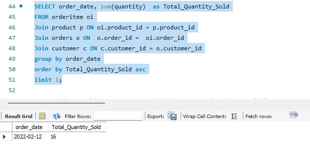

# SQL-GadgetSales-Project-

## Data Source
GadgetSales datasets was used for this project

## Intoduction
Mr. Chinedu has a shop where he sells different kinds of gadgets. He heard you are the data analyst, has been looking for one to help him answer some crucial questions about his business. You have been granted access to a database file called “GadgetSales.sql” containing consumer, orders, order item and product tables.(Which should you already have imported)

## Problem Statement / Questions
1. Which device had the most sales by quantity?
2. Which device had the lowest sales by quantity?
3. Top 3 most expensive gadgets.
4. Top 3 customer names that spent the most. (Hint: Sum of product of price and quantity)
5. Which order date did the least quantity of gadget sold?
6. Which customer name had the most orders by quantity?
7. List 3 devices with the lowest sales by quantity.
8. On which order date did “iPad Pro” had the most sales by quantity?
9. Which customer name bought “iPhone 13” the most by quantity?
10. Between the cheapest device and the most expensive device, which had more quantity sold? And why is the result so?

## Solutions

1. Which device had the most sales by quantity?

    
    
2. Which device had the lowest sales by quantity?

    
    
3. Top 3 most expensive gadgets.

      
      
 4. Top 3 customer names that spent the most. (Hint: Sum of product of price and quantity)

      
      
 5. Which order date did the least quantity of gadget sold?
    
  
 6. Which customer name had the most orders by quantity? 

    
    
 7. List 3 devices with the lowest sales by quantity.

     
 
 8. On which order date did “iPad Pro” had the most sales by quantity?
 
     
     
 9. Which customer name bought “iPhone 13” the most by quantity?
 
     
     
10. Between the cheapest device and the most expensive device, which had more quantity sold? And why is the result so?

Most Expensive Device       |     Cheapest Device
:--------------------------:|:--------------------:
               |      
 
 
Based on the information gotten from the analysis above, the cheapest device, Amazon Echo Dot (4th Gen), sold 10 units, while the most expensive device, Canon EOS R6, sold 8 units. Therefore, the cheapest device had a higher quantity sold.

The result is so because customers may find the Amazon Echo Dot (4th Gen) more affordable and accessible compared to the Canon EOS R6, which is a higher-priced camera. The Echo Dot is a popular and budget-friendly smart speaker, often purchased for its voice-controlled features and compact design. Its lower price point may have made it more appealing to a wider range of customers, resulting in a higher quantity sold.

On the other hand, the Canon EOS R6 is a professional-grade camera that offers advanced features and capabilities, making it a preferred choice for photography enthusiasts and professionals. However, its higher price may have limited its appeal and accessibility to a smaller customer segment, resulting in a lower quantity sold compared to the Echo Dot.

Overall, the quantity sold is influenced by various factors, including price, product features, target market, marketing strategies, and customer preferences.

End.
     
